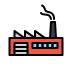

<div id="top"></div>

[![MIT License][license-shield]][license-url]
[![LinkedIn][linkedin-shield]][linkedin-url]

<div align="center">
 <a href="https://github.com/ansango/rtb-starter">
    
  </a>
  <h1 align="center">React Tailwind Blocks - Starter</h1>

  <p align="center">
    Generate UI Component libraries in
    <a href="https://reactjs.org/">React</a>!
    <br />
    <br />
    <a href="https://github.com/ansango/rtb-starter/issues">Report a bug</a>
  </p>
</div>

<!-- TABLE OF CONTENTS -->
<details>
  <summary>Table of Contents</summary>
  <ol>
    <li><a href="#about">About the Project</a></li>
    <li><a href="#built-with">Built with</a></li>
    <li><a href="#getting-started">Getting Started</a></li>
    <li><a href="#usage">First Steps</a></li>
    <li><a href="#roadmap">Create your own Component Generators</a></li>
    <li><a href="#testing">Testing and lint</a></li>
    <li><a href="#storybook">Build and deploy your Storybook</a></li>
    <li><a href="#publish">Build and publish your library</a></li>
    <li><a href="#">Install your own library</a></li>
    <li><a href="#contributing">Contributing</a></li>
    <li><a href="#license">License</a></li>
  </ol>
</details>

## Abut the Project

This project has been created to generate component libraries in [React](https://reactjs.org/).

It is based on [React](https://reactjs.org/), [Tailwindcss](https://tailwindcss.com/), and [Storybook](https://storybook.js.org/). With this starter you can start writing isolated and tested components, ready to publish and consume as packages in [npm](https://www.npmjs.com/).

## Built with

- [_React_](https://reactjs.org/)
- [_Typescript_](https://www.typescriptlang.org/)
- [_Tailwindcss_](https://tailwindcss.com/)
- [_Storybook_](https://storybook.js.org/)
- [_Jest_](https://jestjs.io/)
- [_React Testing Library_](https://testing-library.com/docs/react-testing-library/intro/)
- [_ESlint_](https://eslint.org/)
- [_Prettier_](https://prettier.io/)
- [_Rollup_](https://rollupjs.org/guide/en/)
- [Plop js!](https://plopjs.com/)
- [Husky](https://typicode.github.io/husky/#/)

## Getting Started

Use this templete or:

```bash
git clone https://github.com/ansango/rtb-starter.git
```

and install the dependencies:

```bash
yarn install # or npm install
```

<p align="right"><a href="#top">back to top</a></p>

## First Steps

First, open the terminal and run:

```bash
yarn start
```

> This script runs Storybook in the development mode at [http://localhost:6006](http://localhost:6000)

### Create a component

```bash
 yarn generate:c
```

> This script generates template files to coding a component. You will find all the files in `src/components` folder. Your component folder contains:

- `Component.tsx` file:

```jsx
import { FC } from "react";
import * as cn from "./SampleComponentStyles";

export type SampleComponentProps = {
  /**
   * Description of options in Storybook
   */
  option?: "option__one" | "option__two" | "option__three",
  /**
   * Optional click handler
   */
  onClick?: () => void,
  /**
   * Class Name override
   */
  className?: string,
};

/**
 * Description of SampleComponent component displayed in Storybook
 */

const SampleComponent: FC<SampleComponentProps> = ({
  option = "option__one",
  className,
  ...props
}) => {
  const cnOption = cn.options[option];
  const styles = className ?? cnOption;
  return (
    <div className={styles} {...props}>
      <span>SampleComponent</span>
    </div>
  );
};

export default SampleComponent;
```

- `ComponentStyle.ts` file, to write Tailwind classes as blocks:

```js
/**
 ** Write your tailwind classes as objects and strings and import them in your component
 */

export const options = {
  option__one: "bg-red-500 text-white font-bold py-2 px-4 rounded max-w-xs cursor-pointer",
  option__two: "bg-green-500 text-white font-bold py-2 px-4 rounded max-w-sm cursor-pointer",
  option__three: "bg-blue-500 text-white font-bold py-2 px-4 rounded max-w-md cursor-pointer",
};
```

- `Component.test.tsx` file, to testing your component:

```jsx
/**
 *? SampleComponent Test
 */

import { render, screen } from "@testing-library/react";

import SampleComponent from "./SampleComponent";

describe("<SampleComponent />", () => {
  it("should render", () => {
    render(<SampleComponent />);
    expect(screen.getByText("SampleComponent")).toBeInTheDocument();
  });
});
```

- `Componente.stories.tsx` file to write your Storybook component:

```jsx
/**
 * ? SampleComponent Story
 */

import { ComponentStory, ComponentMeta } from "@storybook/react";
import SampleComponent from "./SampleComponent";

export default {
  title: 'Samples/SampleComponent',
  component: SampleComponent,
} as ComponentMeta<typeof SampleComponent>;

const Template: ComponentStory<typeof SampleComponent> = (args) => <SampleComponent {...args} />;

export const OptionOne = Template.bind({});

OptionOne.args = {
  option: "option__one",
};

export const CustomClass = Template.bind({});

CustomClass.args = {
  className: "bg-yellow-500 text-white font-bold py-2 px-4 rounded max-w-lg cursor-pointer",
};
```

<p align="right"><a href="#top">back to top</a></p>

## Create your own Component Generators

To generate the templates I use [plop](https://plopjs.com/). You can create other modules in other different dependencies. Checkout `src/generators/sample` base.

Then add your script into `package.json` and run!

```json
// package.json
{
  "scripts": {
    "generate:s": "plop --plopfile generators/sample/generator.js"
  }
}
```

<p align="right"><a href="#top">back to top</a></p>

## Test, lint & Husky

You can run unit tests in **watch mode** or run all serial tests **in current process**:

```bash
 yarn test:watch #watch mode
 yarn test:ci #current process
```

You can also run [ESlint](https://eslint.org/), tests and coverage:

```bash
 yarn test
```

Or run [ESLint](https://eslint.org/):

```bash
  yarn lint
```

Before you can commit to your repository ESlint and all tests will be run, if they fail [Husky](https://typicode.github.io/husky/#/) will not let you commit.

<p align="right"><a href="#top">back to top</a></p>

## Build and deploy your Storybook

It's easy, run the following script to compile your Storybook in **`/storybook-static` folder**:

```bash
 yarn build:dist
```

> Easy to do at [Vercel](https://vercel.com/).

<p align="right"><a href="#top">back to top</a></p>

## Build and publish your library

Build runs by [Rollup](https://rollupjs.org/) and its entry point is `src/index.ts` file.

Please make sure that **all your components** are being imported and exported in this file.

```js
// src/index.ts

import Button from "./components/Button/Button";
export { Button };
```

Then run the following script and you can find the bundle in **`/dist` folder** to be published at [npm](https://docs.npmjs.com/cli/v8/commands/npm-publish):

```bash
 yarn build:dist
```

> To publish run `npm publish` (after login `npm login`)

<p align="right"><a href="#top">back to top</a></p>

## Install your own library

Simple, install it!

```bash
yarn add {awesome-library} # or npm i {awesome-library}
```

Because we use Tailwindcss, we have to install and configure it. [Read the docs](https://tailwindcss.com/docs/installation).

You have to add the following in your `tailwind.config.js`:

```js
module.exports = {
  content: [
    "./components/**/*.{html,js}",
    "./pages/**/*.{html,js}",
    "./node_modules/awesome-library/dist/**/*.{js,ts,jsx,tsx}",
  ],
  // ...
};
```

> [See more](https://tailwindcss.com/docs/content-configuration#working-with-third-party-libraries)

These are current `peerDependencies` you must be in your new project:

```json
//package.json
{
  "postcss": "^8.4.5",
  "react": "^17.0.2",
  "react-dom": "^17.0.2",
  "tailwindcss": "^3.0.16"
}
```

If you have problems, please open an [issue](https://github.com/ansango/rtb-starter/issues)

<!-- CONTRIBUTING -->

## Contributing

Contributions are what make the open source community such an amazing place to learn, inspire, and create. Any contributions you make are **greatly appreciated**.

If you have a suggestion that would make this better, please fork the repo and create a pull request. You can also simply open an issue with the tag "enhancement".
Don't forget to give the project a star! Thanks again!

1. Fork the Project
2. Create your Feature Branch (`git checkout -b feature/AmazingFeature`)
3. Commit your Changes (`git commit -m 'Add some AmazingFeature'`)
4. Push to the Branch (`git push origin feature/AmazingFeature`)
5. Open a Pull Request

<p align="right">(<a href="#top">back to top</a>)</p>

<!-- LICENSE -->

## License

Distributed under the MIT License. See `LICENSE.txt` for more information.

<p align="right">(<a href="#top">back to top</a>)</p>

<!-- MARKDOWN LINKS & IMAGES -->
<!-- https://www.markdownguide.org/basic-syntax/#reference-style-links -->

[license-shield]: https://img.shields.io/github/license/othneildrew/Best-README-Template.svg?style=for-the-badge
[license-url]: https://github.com/ansango/rtb-starter/blob/main/LICENSE.txt
[linkedin-shield]: https://img.shields.io/badge/-LinkedIn-black.svg?style=for-the-badge&logo=linkedin&colorB=555
[linkedin-url]: https://linkedin.com/in/ansango
